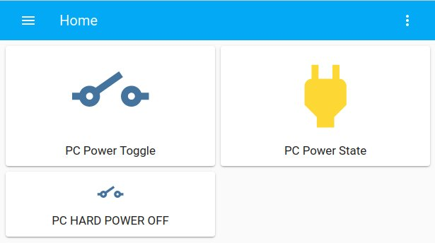
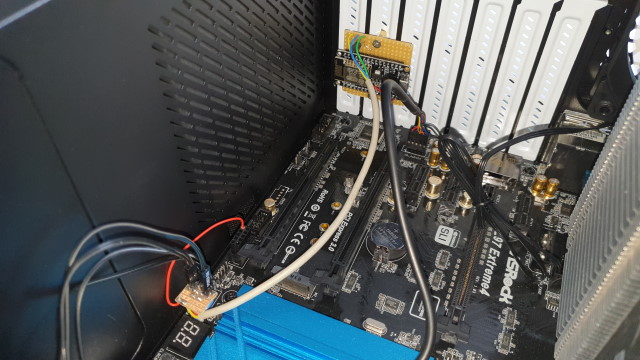

# ESP8266 ESPHome PC Power Control via Home Assistant

This project contains PC power control via HomeAssistant and ESPHome ESP8266 NodeMCU.  I use this project to power my ATX based NAS remotely on and off via Home Assistant.

Features:

* Short press power button to turn PC on or graceful shutdown.
* Long press power button to generate hard power-off.
* Read power status motherboard (is PC turned on or off).
* Use existing power / reset buttons at the front panel.



## Hardware

The hardware consists of an ESP8266 and two IO pins, mounted on a PCI metal plate (see picture below). In my case I used an ESP8266 NodeMCU board. Theoretically any ESP8266 or ESP32 board can be used for this project.

One pin controls the power button by generating a long or short press and a second pin to read the power status of the ATX motherboard.


## Schematic

My NAS is based on an Intel Core I7 ASRock Z97 ATX motherboard and contains standard 2x5 male connectors:

**ATX header USB 2.0:**

Header `J1` pin 1 constant +5V power on pin 1, even when the PC is power-off and is used to power the NodeMCU. The ESP8266 or ESP8266 is powered via an on-board 3V3 regulator.

**ATX header System panel:**

Header `J2` contains the power, reset and GND pins:

* Power button pin 6.
  * Short press: Turn PC on or off
  * Long press: Generate hard reset
* Reset button pin 7.
  * Used to read power status (not for hard reset)
* GND pin 5.

* Pin `D1` is used to read the power status from the reset pin: High is on, Low is off. Transistor `Q1` is used for secure isolation between ESP8266 and motherboard.
* Pin `D2` is used to pull the power button low to generate a short or long press. Resistor `R1` is used to minimize current when the IO pin is accidentally set to output.

All ATX and ESP8266 pins must be operating at 3V3.


## Downloads

* [KiCad schematic .SCH](kicad/ESP8266-ESPHome-PC-Power-HomeAssistant.pro)

## Wiring

A DIY breakout PCB can be mounted at the system panel header to connect power button `SW1` and reset button `SW2`.

There is sufficient space in the ATX computer case to mount the ESP8266 board and connecting a USB cable to program the ESP8266.



## ESPHome

The ESPHome application consists of the two Yaml files. One configuration file and a second `secrets.yaml` to store passwords.

Documentation:

* [ESPHome GPIO Switch](https://esphome.io/components/switch/gpio.html)
* [ESPHome Binary Sensor](https://esphome.io/components/binary_sensor/gpio.html)

### pc-power.yaml

```yaml
esphome:
  name: pc-power
  platform: ESP8266 # ESP8266 or ESP32
  board: nodemcuv2  # Any ESP8266 or ESP32 board

wifi:
  ssid: !secret esphome_wifi_ssid
  password: !secret esphome_wifi_password
  # Enable fallback hotspot (captive portal) in case wifi connection fails
  ap:
    ssid: "Relay Fallback Hotspot"
    password: !secret esphome_ap_password

api:
  password: !secret esphome_api_password
ota:
  password: !secret esphome_ota_password

switch:
  - platform: gpio
    name: "PC Power button"
    icon: "mdi:electric-switch"
    pin: D2   # Power button output pin
    inverted: no
    id: power_pin
binary_sensor:
  - platform: gpio
    pin: D1   # Power detect input pin
    name: "PC Power Sense"
    device_class: power
```

### Secrets.yaml

```yaml
esphome_api_password: "changeme"
esphome_ota_password: "changeme"
esphome_ap_password: "changeme"
esphome_wifi_ssid: "ssid"
esphome_wifi_password: "password"
```

### Program ESP8266

Connect USB cable to ESP8266 board and enter the following commands. (Examples are tested on Ubuntu). For more information, refer to [ESPHome.io](https://esphome.io/guides/getting_started_command_line.html).

```bash
# Install Python3 virtualenv
$ sudo apt install python3-virtualenv

# Create virtualenv
$ virtualenv venv

# Activate virtualenv
$ source venv/bin/activate

# Install ESPHome
$ pip install esphome

# Check ESPHome installation
$ esphome --help

# Upload program to ESP8266
$ esphome pc-power.yaml run

Select serial upload port

# Check logs
$ esphome pc-power.yaml logs
```

## Home Assistant configuration

This section describes Home Assistant configuration.

### Register ESP device

* `Configuration | Integrations: Add Integration: ESPHome`
* Select hostname or IP address of the ESP device.
* Enter password as configured in `secrets.yml` `esphome_api_password`.

### Create Automation Scripts

Two scripts are needed to generate a short and long pulse of the power button.

`Configuration | Scripts | Add script`:

* Name: pc_power_button_short_press
* Action type: Device
  * Action: Turn on PC power button
* Action type: Delay 600ms
* Action type: Device
  * Action: Turn off PC power button

`Configuration | Scripts | Add script`:

* Name: pc_power_button_long_press
* Action type: Device
  * Action: Turn on PC power button
* Action type: Delay 5s
* Action type: Device
  * Action: Turn off PC power button

### Edit Dashboard | RAW Configuration Editor

```yaml
  - title: PC
    path: pc
    badges: []
    cards:
      - type: button
        entity: switch.pc_power_button
        show_name: true
        tap_action:
          action: call-service
          service: script.pc_power_button_short_press
        name: PC Power Button
      - type: button
        tap_action:
          action: none
        entity: binary_sensor.pc_power_sense
        hold_action:
          action: none
      - type: button
        entity: switch.pc_power_button
        show_name: true
        tap_action:
          action: call-service
          service: script.pc_power_button_long_press
        name: PC Force OFF
        icon_height: 40px
```

Restart Home Assistant and ready to go!
